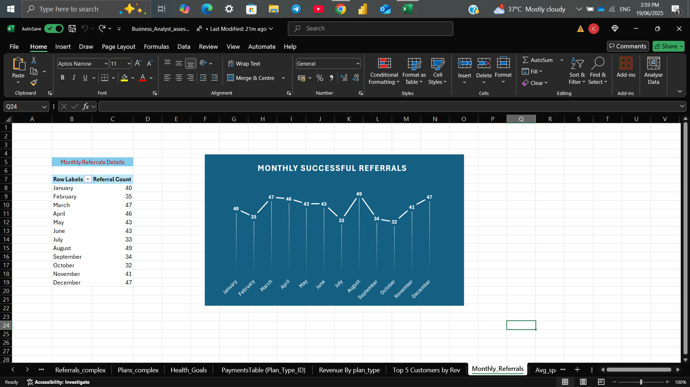

# WellWise Solutions – Business Analyst Case Study (Excel Project)

This project simulates a business analyst role at **WellWise Solutions**, a fictional health and wellness company. The case study involved analyzing user data, payment transactions, referrals, plans, and health goals to generate key business insights using Excel and Power Query.

## 🎯 Objectives

- Analyze total revenue by plan type
- Identify top 5 customers by total spending
- Track monthly trends in successful referrals
- Understand payment method usage
- Determine user retention (repeat customers)
- Visualize age vs. spending with a scatter plot

## 🧰 Tools Used

- Microsoft Excel
- Power Query
- Pivot Tables
- Charts: Bar, Line, Scatter
- Trendline Analysis

## 📎 Files Included

| File Name | Description |
|-----------|-------------|
| `Business_Analyst_assesment.xlsx` | Excel file with cleaned data, pivot tables & charts |
| `Wellwise_Business Analysis_Rep.pdf` | Final report with screenshots & insights |
| `.png` files | All chart images used in the report & README |

## 📸 Visual Samples

### 💰 Revenue by Plan Type

### 🔁 Repeated Users by Plan

### 💳 Payment Method Distribution

### 📈 Monthly Successful Referrals

### 📊 Age vs Spending (Scatter Plot)

## 📊 Key Business Insights

- **12-month plans** generate the most revenue and have higher retention rates.
- **Male users aged 25–34** dominate the top spenders group.
- Referral activity peaked in specific months, showing **seasonal spikes**.
- **Digital payment methods** are the most preferred.
- Users in the **28–42 age range** spend more, confirmed by a positive trendline in the scatter plot.

--
Jagadeesh Chandrasetty 
Data Analyst|BI specialist 
📍 Bengaluru 

[LinkedIn]: https://www.linkedin.com/in/jagadeesh-chandrasetty-48162a27a
